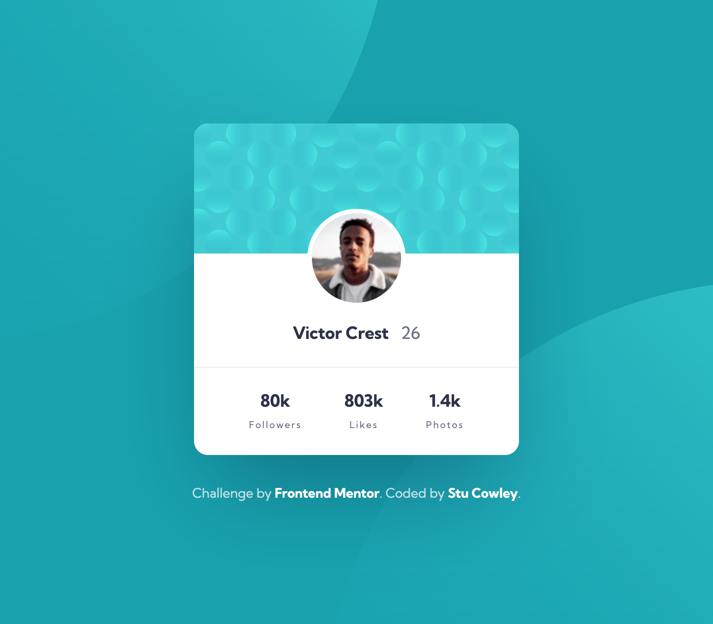

# Frontend Mentor - Profile card component solution

This is a solution to the [Profile card component challenge on Frontend Mentor](https://www.frontendmentor.io/challenges/profile-card-component-cfArpWshJ). Frontend Mentor challenges help you improve your coding skills by building realistic projects.

## Table of contents

- [Overview](#overview)
  - [The challenge](#the-challenge)
  - [Screenshot](#screenshot)
  - [Links](#links)
- [My process](#my-process)
  - [Built with](#built-with)
  - [What I learned](#what-i-learned)
- [Author](#author)
- [Acknowledgments](#acknowledgments)

## Overview

### The challenge

- Build out the project to the designs provided

### Screenshot

### Links

- [Solution URL](https://github.com/frontendstu/profile-card-component)
- [Live Site URL](https://frontendstu.github.io/profile-card-component/)

## My process

### Built with

- Semantic HTML5 markup
- CSS custom properties
- Sass
- Flexbox
- Mobile-first workflow

### What I learned

I felt that this one wasn't too much of a challenge. I wasn't 100% sure what the right approach was for the profile stats. Should I have used a `<ul>`? or was using flexbox good practice. I'm not sure. I looked at a few other solutions and from the other solutions I found that this was the most common approach.

This challenge was more a quick one to fill in some time and make my way through all of the newbie challenges.

## Author

- GitHub - [frontendstu](https://github.com/frontendstu)
- Frontend Mentor - [@frontendstu](https://www.frontendmentor.io/profile/frontendstu)
